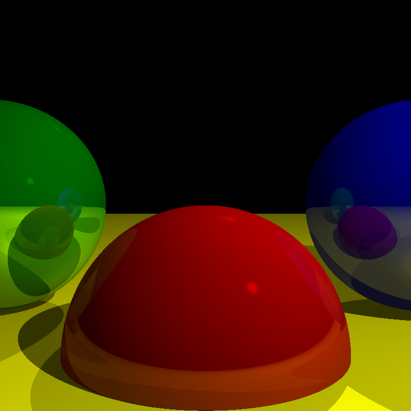
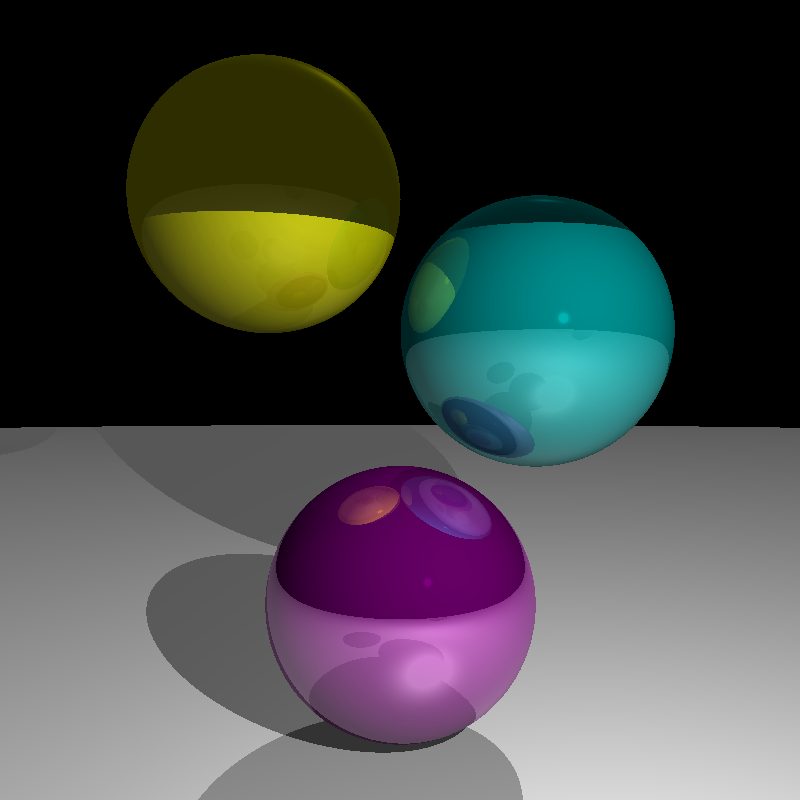

# Software Renderer

A simple software-based 3D renderer written in C++. This project implements basic rendering techniques using only the CPU, without relying on GPU acceleration.

## Features
- Basic 3D object rendering
- Simple lighting model (ambient, directional, point lights)
- Ray tracing for sphere rendering
- Diffuse and specular lighting reflections
- Object reflections and shadows

## Screenshots

## Future Plans
- Optimize with multithreading
